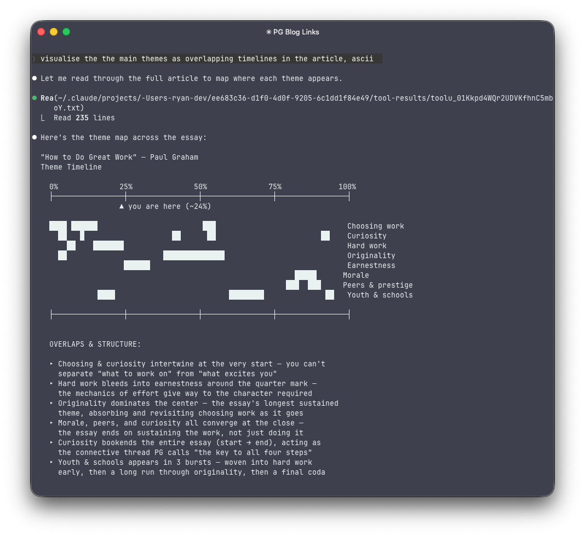

# readwise-skill

A plugin for using [Readwise](https://readwise.io) and [Reader](https://readwise.io/read) in your AI agents. Works with [Claude Code](https://docs.anthropic.com/en/docs/claude-code), [Claude Desktop / Cowork](https://claude.ai/download), [OpenAI Codex](https://github.com/openai/codex), [OpenClaw](https://github.com/nicobailon/openClaw), and other agent harnesses that support standalone skill zips.

It shines when working across your entire library - extracting quotes from transcripts, saving generated highlights across multiple sources, triaging your inbox, and connecting highlights across books.

Compared with the official Readwise MCP ([docs](https://readwise.io), [npm](https://www.npmjs.com/package/@readwise/readwise-mcp)), this skill used `2.0x-9.4x` fewer end-to-end tokens across four overlapping read-only tasks with `GPT-5.4`; the MCP benchmarked here is also read-only and highlights-only, so daily review, highlight CRUD, and Reader workflows are outside its coverage.

```text
Cross-book comparison token shape
= non-tool tokens
# tool-result payload tokens

skill [===####]                       ~5.1k
mcp   [==##########################]  ~20.3k
advantage: 4.0x
```

## What you can do

The basics work as you'd expect - search highlights, daily review, save articles. The interesting part is what becomes possible when your agent can read and write across your whole library.

Visualize the structure of a Paul Graham essay saved in Reader:

<p align="center">
  
</p>

Save a video, extract quotes, and archive - all in one conversation:
```
> Save this to Reader: https://www.youtube.com/watch?v=OfMAtaocvJw
Done. Saved "The third golden age of software engineering" to Reader.

> Get the transcript and suggest the most surprising quotes
Here are 3 quotes that challenge conventional thinking:
1. "Fear not, O developers. Your tools are changing, but your problems are not."
2. "We're not going to have fewer software engineers - we're going to have
    more, doing things we couldn't imagine"
3. ...

> Save #1 and #2 to Readwise, then archive the video
Done. Saved 2 highlights to Readwise and archived the document in Reader.
```

Check your reading list:
```
> What are my latest unread Reader docs?

| Title                                          | Source           | Words | Progress |
|------------------------------------------------|------------------|------:|:--------:|
| Does AI already have human-level intelligence? | nature.com       | 2,374 |    0%    |
| Interpretability vs Neuroscience               | colah.github.io  | 1,394 |    0%    |
| On neural scaling and the quanta hypothesis    | ericjmichaud.com | 9,976 |    0%    |

... (7 more)
```

Triage your feed, then save what matters:
```
> What are my latest RSS articles? Rank by novelty.

High novelty:
- The Yodogo Hijacking (historical narrative)
- My Enemy, The Leitmotif (music/aesthetics critique)
- The Church Of Interruption (attention/tech critique)

Low novelty:
- How Transformers Architecture Powers Modern LLMs
- A Guide to Effective Prompt Engineering

> Save #1 and #2 to Readwise
Done. Saved 2 highlights to Readwise.
```

```
> Pull my highlights from "Thinking in Systems" and create an Excalidraw
  diagram of the key feedback loops

> Build me an interactive HTML demo of the reinforcing loops from chapter 3
  using my highlights as source material

> Compare my highlights from "Meditations" and "Letters from a Stoic" -
  where do Aurelius and Seneca agree? Where do they diverge?
```

## Getting started

Set your Readwise access token (find it at https://readwise.io/access_token):
```
export READWISE_TOKEN=<your-token>
```

### Claude Code

```
/plugin marketplace add ryanlyn/readwise-skill
/plugin install readwise@readwise-skill
```

Or store your token as a Claude Code secret so it persists across sessions.

### Claude Desktop / Cowork

Install the plugin from the marketplace, then set `READWISE_TOKEN`. One option is to create a `.env` file in your project folder and open it in Claude Desktop / Cowork.

### Standalone skill zips (Codex, OpenClaw, etc.)

Skill zips are published as CI artifacts on each push to `main`. Download the latest from the [Actions tab](https://github.com/ryanlyn/readwise-skill/actions) or build from source (see Development).

Install one or both skills (they work independently). Set `SKILL_HOME` to whatever directory your agent harness uses for skills:

```bash
VERSION="0.2.1"  # check CI artifacts for latest
# Set SKILL_HOME for your harness, e.g.:
#   Codex:    export SKILL_HOME="${CODEX_HOME:-$HOME/.codex}/skills"
#   OpenClaw: export SKILL_HOME="$HOME/.openclaw/skills"
unzip -o "readwise-${VERSION}.zip" -d "$SKILL_HOME"
unzip -o "readwise-reader-${VERSION}.zip" -d "$SKILL_HOME"
```

Start a new session after installing.

### Verify

Ask your agent: `Validate my Readwise token`

## Privacy & data

Your Readwise access token grants full read/write access to your account. This plugin only communicates with `readwise.io` API endpoints - no data is sent anywhere else. Destructive operations (`highlight delete`) prompt for confirmation. Use `--dry-run` to preview payloads before any write.

## Uninstall

**Claude Code:**
```
/plugin uninstall readwise@readwise-skill
```

**Claude Desktop / Cowork:** Remove the plugin from Plugins.

**Standalone skill zips:**
```bash
rm -r "$SKILL_HOME/readwise" "$SKILL_HOME/readwise-reader"
```

## Development

See [CLAUDE.md](CLAUDE.md) for project structure, conventions, and development setup.

## License

[MIT](LICENSE)
